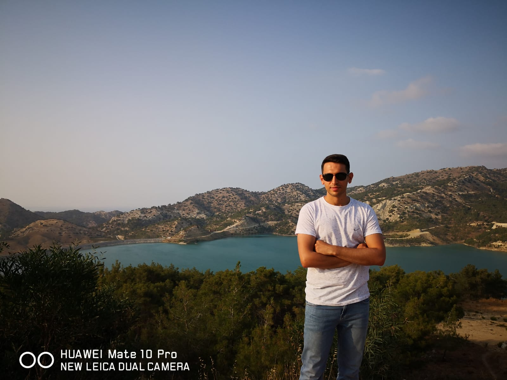

# Mehmet Doğan - Front-End Developer

I am an innovative, self-confident Front-End Developer who believes that successful work comes with teamwork and that learning never ends.

## Connect with Me

## Technologies Used

- HTML5
- CSS3
- Git
- GitHub
- VS Code

## About Me

My name is Mehmet Doğan, and I am a passionate Front-End Developer with a strong belief in the power of collaboration and continuous learning. I specialize in creating dynamic and user-friendly web applications.

## Portfolio

## Learn More

Click the button below to learn more about my work and projects.

## Subscribe!

Subscribe now for the latest updates and exciting projects.

## Contact Me

Feel free to reach out to me:

- Email: [mehmetseymen91@gmail.com](mehmetseymen91@gmail.com)
- LinkedIn: [Mehmet Doğan on LinkedIn](https://www.linkedin.com/in/mehmet-do%C4%9Fan-1911a2222)
- Github: [Mehmet Doğan](https://github.com/Mehmet-github06)
